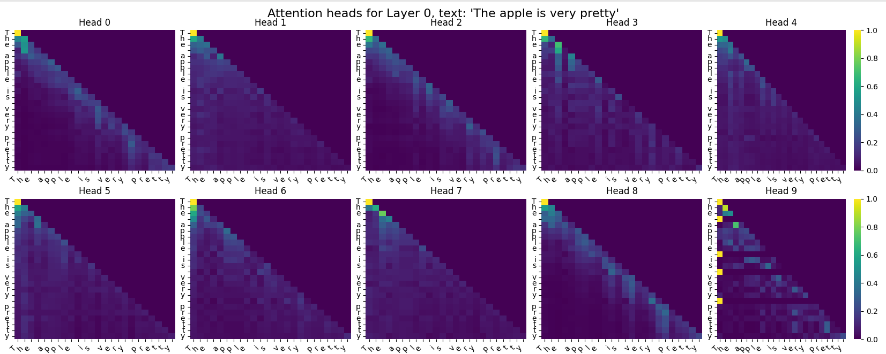
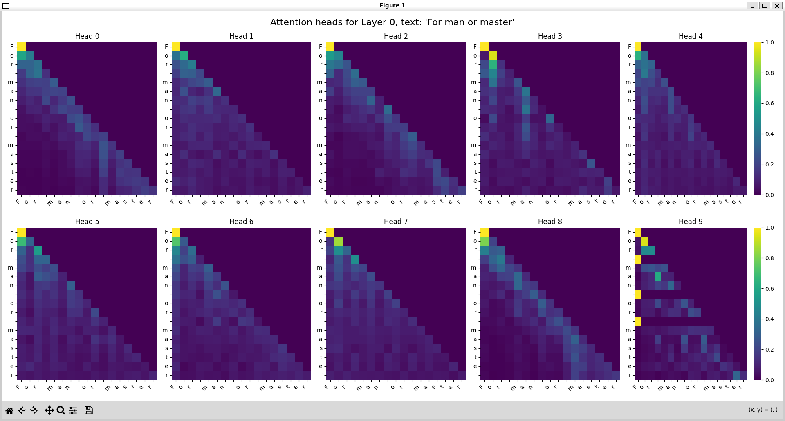
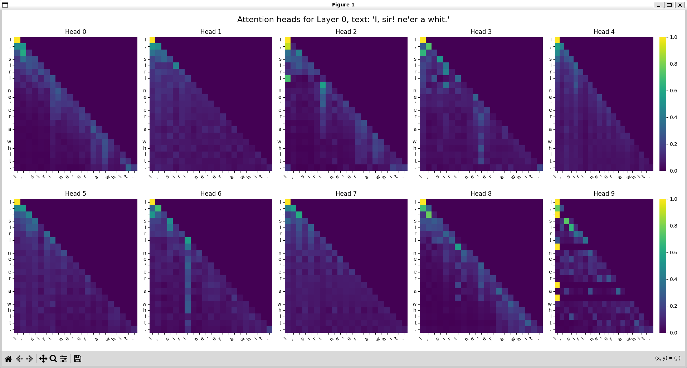
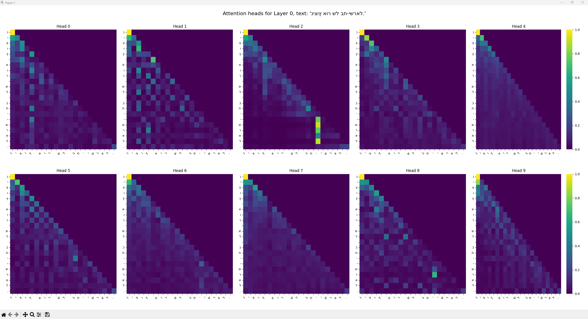
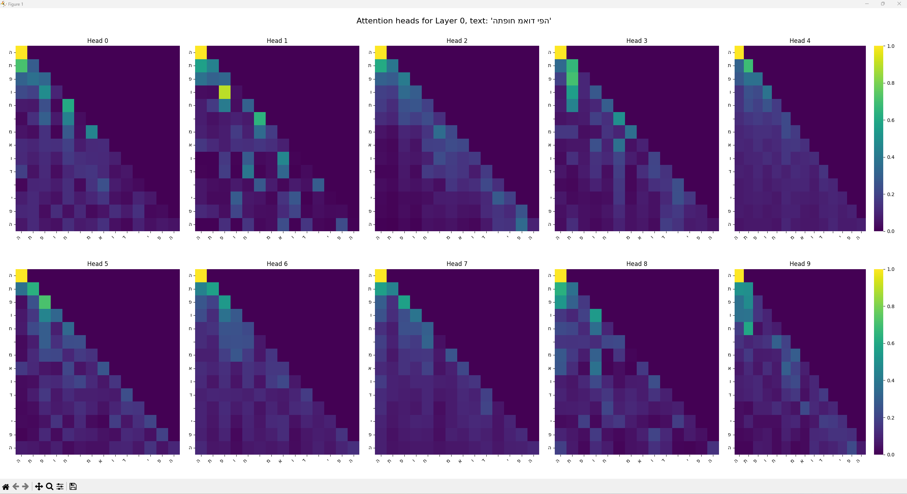

# Assignment 1: Transformer Language Model Report

**1. Baseline Shakespeare Results**
* **Final Training Loss:** 1.1653
* **Final Average Evaluation Loss:** 1.2900
* **Total Updates:** 20,000
* **Training Sequences Seen:** 1.28M ($20,000 \text{ batches} \times 64 \text{ batch size}$)
* **Network Parameters:** 1.24M

**2. Hyperparameters Used**
To achieve the baseline loss mentioned above, We used the following configuration:
* **Sequence Length:** 128
* **Batch Size:** 64
* **Number of Layers:** 10
* **Number of Heads:** 10
* **Embedding Dimension:** 100
* **MLP Hidden Size:** 400
* **Normalization:** Pre Norm

**3. Modifications and Experiments**
* **Initialization:** We implemented the GPT-1 style initialization (applies a hardcoded standard deviation of 0.02 across all linear and embedding layers.). This improved the convergence rate significantly, dropping the loss from 2.45 to 1.91 in the first 500 batches, compared to the 2.5 to 2.0 with the default weights
* **Optimizer:** We used AdamW with a learning rate of `5e-4` and gradient clipping of 1.0, didnt think there was any point of changing it.
* **Dropout:** We added a `0.3` dropout rate to the embeddings and the attention weights. without it it took much longer to get to the 1.4 evaluation loss, also with the dropout we were able to reach even 1.29 evaluation loss compared to the 1.32 we got without the dropout.
decreasing the dropout to `0.2` made the loss worse, likely because the model is overfitting.
* **Architecture Tweaks:** We experimented with increasing the number of layers to 8 and eventualy 10, while decreasing the embed size, this caused the train slower then before but made it so there will be much less overfit

* **Layer 0 Attention Head Analysis:**
This section details the interpretability analysis conducted on Layer 0 of the character-level Transformer Language Model. By visualizing the attention weights across multiple sequences (including plain text and heavily punctuated Shakespearean text), distinct and specialized linguistic behaviors were identified across the 10 attention heads.

As an early layer in the network, Layer 0 primarily focuses on structural, syntactic, and positional encoding rather than deep semantic meaning.

* **Head 8: The Previous-Character Tracker (Induction Head Precursor):**
Head 8 exhibits a rigid, heavily defined diagonal line shifted exactly one position to the left of the main diagonal. Regardless of the current query character, this head exclusively attends to the character immediately preceding it. This represents a foundational positional mechanism, allowing the model to track simple n-gram transitions (e.g., identifying that 'h' follows 'w') before building more complex grammar in deeper layers.

* **Head 9: The Attention Sink and Boundary Marker:**
Head 9 demonstrates a classic "attention sink" behavior. Because the softmax operation forces attention weights to sum to 1.0, heads must allocate weight somewhere even if their target feature is absent. Head 9 overwhelmingly dumps its attention onto the very first token of the sequence. Additionally, horizontal striations appear when the model processes word boundaries or spaces, indicating it briefly shifts attention back to the sequence origin upon completing a semantic chunk.

* **Heads 6 and 2: Syntactic and Punctuation Anchors:**
When exposed to text with complex punctuation, Heads 6 and 2 reveal themselves as structural anchors. Head 6 forms a dense, bright vertical band directly on major punctuation marks, most notably the exclamation point (!). Head 2 exhibits similar but slightly weaker tracking on commas (,) and other separators. These heads allow the model to continuously "look back" at the last structural boundary, helping it maintain awareness of the current clause or sentence segment.

* **Head 3: The Self-Attention Anchor:**
Head 3 produces a razor-sharp, perfectly straight line directly on the main diagonal. This indicates an almost exclusive focus on the current token being processed, with minimal attention scattered to the surrounding context. This mechanism isolates the raw embedding of the current character and passes it forward to the next layer intact.

* **Heads 0, 1, 4, 5, and 7: Local Context Windows:**
These remaining heads display a diffused, triangular fade stretching downward from the main diagonal. Rather than searching for specific positional or syntactic triggers, these heads act as rolling short-term memory windows. They aggregate information from the immediate 3 to 5 preceding characters. In a character-level model, this rolling window is essential for assembling individual letters into cohesive syllables and short words.

* **Conclusion of Layer 0 Behavior:**
The visualizations confirm that the first layer of this character-level transformer heavily partitions its subspace to solve basic structural problems. It isolates local chunking (Heads 0, 1, 4, 5, 7), explicit positional tracking (Head 8), structural boundaries (Heads 2, 6), and identity preservation (Head 3), providing a stable foundation for deeper layers to process higher-level language patterns.

**4. Hebrew Data Observations**
* **Final Loss:** Final Training Loss: 1.5405 | Lowest Validation Loss: 1.8497 (at batch 9000).
* Training Sequences Seen (at convergence): 576,000 ($9,000 \text{ batches} \times 64 \text{ batch size}$)
* **Parameters:** We maintained the core architecture from the English model (10 layers, 10 heads, 100 embedding dimension), but reduced the dropout to 0.1 to prevent underfitting and achieve the best validation score.
* **Observations:** The Hebrew model converged significantly faster than the English model, hitting its lowest validation loss at batch 9,000 (compared to batch 14,000 for English). While it converged faster, its overall validation loss plateaued higher than the English model (1.84 vs 1.27). We noticed that the output quality correlated well with the loss; around a loss of 2.0, the model started forming valid 3-4 letter Hebrew words, and below 1.7, it began mimicking the poetic line breaks present in the Bialik and Rachel dataset.

* **Robustness and Memorization Check:**
  * **Context:** Upon inspecting the tokenized Hebrew dataset (Bialik and Rachel poems), we identified anomalous out-of-distribution characters, specifically English (Latin) and Russian (Cyrillic) letters. These were likely included due to metadata, typos, or noisy data artifacts in the original text files.
  * **Methodology:** To determine if the model had overfitted and memorized these noisy sequences (which would indicate poor generalization), we conducted a targeted stress test. We prompted the model with multiple contexts—ranging from in-distribution classical Hebrew phrases to out-of-distribution modern Hebrew sentences—and forced it to generate large blocks of text (500 tokens per prompt). We then programmatically scanned the generated outputs for any foreign characters.
  * **Findings & Conclusion:** The model output zero English or Russian characters across all generations, strictly adhering to standard Hebrew text and punctuation. This strongly indicates that the model successfully generalized the core structural and syntactic rules of the Hebrew language rather than simply memorizing exact, noisy data chunks. The foreign characters present in the training set remained appropriately marginalized as extremely low-probability events, demonstrating the model's robust resistance to dataset noise.

**5. Analysis / Interpretability (Part 5)**

**Hebrew Model Interpretability Analysis**

* **Methodology:** We adapted the attention analysis script to load the Hebrew dataset tokenizer and our best-performing Hebrew checkpoint (Validation Loss: 1.8497). We passed a sample sentence from the training dataset ("ניצוץ אור של בת-ישראל.") through the model and visualized the attention probability matrices for Layer 0 using `seaborn` heatmaps.
* **Finding 1: The Previous-Character Monitor (Head 1):** Similar to the English model, we found that Layer 0, Head 1 acts strictly as a "Previous Character Monitor." The heatmap displays a solid, bright diagonal line shifted exactly one index below the main diagonal. This confirms that the model quickly learns local, sequential character dependencies (n-gram transitions) as a foundational step, regardless of the language's structural rules or Right-to-Left (RTL) nature.
* **Finding 2: The Self-Attention Anchor (Head 3):** Head 3 produces a razor-sharp line directly on the main diagonal. This indicates an almost exclusive focus on the current token being processed. This mechanism isolates the raw embedding of the current character to pass it forward to the next layer intact, without mixing it with surrounding context.
* **Finding 3: Attention Sinks (Heads 4 and 7):** Heads 4 and 7 exhibit classic "attention sink" behavior. Both display a dominant, solid vertical band on the very first token ('נ'). Because the softmax operation forces attention weights to sum to 1.0, these heads dump their unused attention mass onto the sequence's origin point when they are not actively triggered by other specific linguistic features.
* **Finding 4: Structural Boundary Anchoring (Head 2):** Head 2 shows a highly specific structural behavior. It maintains low attention until it encounters the hyphen ('-') and the subsequent letters of "ישראל", at which point it forms a bright vertical band. This suggests the head is tracking compound word boundaries or specific punctuation constraints to maintain the context of the current clause.
* **Finding 5: Cross-Language Consistency (English Test):** To verify if these behaviors were universal, we tested the English phrase "The apple is very pretty" on the English model. We found that **Layer 2, Head 1** also acted as a "Previous Character Monitor," showing that the transformer architecture naturally defaults to these positional tracking mechanisms across different languages and training sets.

**Out-of-Distribution (Modern Hebrew) Analysis**

* **Methodology:** To test the model's robustness, we passed a modern, conversational Hebrew sentence that does not exist in the classical training dataset: "התפוח מאוד יפה" (The apple is very pretty). We visualized the resulting Layer 0 attention matrices to see how the model handles out-of-distribution (OOD) syntax. *(Note: The visualization library renders the Hebrew characters left-to-right on the axes, but the token sequence remains intact).*
* **Finding 1: Breakdown of Local Structure (Heads 1 & 3):** In the in-distribution Bialik text, Head 1 was a strict "Previous Character Monitor" (sharp off-diagonal line) and Head 3 was a "Self-Attention Anchor" (sharp main diagonal). In this modern sentence, those crisp lines are heavily blurred and fragmented. The model struggles to confidently link consecutive characters, causing the attention probability mass to "smear" across adjacent tokens rather than isolating them cleanly.
* **Finding 2: Over-reliance on the Attention Sink (Heads 0, 4, 5, 7, 9):** When the model does not recognize familiar structural patterns, it defaults to dumping its attention mass onto the first token. Here, we see massive, thick vertical bands on the initial 'ה' (the definite article "The"). Because the model lacks predictive confidence in the modern phrasing, multiple heads fall back on this "safe" origin point.
* **Finding 3: Diffuse / "Panicked" Attention (Heads 2 & 6):** Unlike the highly specific structural anchoring seen in the training data, Heads 2 and 6 exhibit blocky, diffuse checkerboard patterns. The model is attempting to chunk the word boundaries (like the spaces around "מאוד"), but because the vocabulary and spacing don't match the poetic rhythm it was trained on, the attention is scattered uniformly across whole sections of the word rather than pinning to specific grammatical anchors.

**6. Project Experience**
Implementing the causal mask and ensuring the dimensions lined up for the multi-head attention concatenation was the most challenging part of the coding process. However, building the training loop and finally watching the loss drop below 2.0 while generating recognizable English words was highly rewarding.

english:

Seen 20000 batches. Train loss: 1.2411 | Val loss: 1.3318 english 8, 8, 96, 0.2 dropout
Seen 20000 batches. Train loss: 1.2769 | Val loss: 1.3261 english 8,8, 80, 0.2 dropout

Seen 20000 batches. Train loss: 1.1160 | avgVal loss : 1.3200 english 10, 10, 100, 0.1
Lowest validation loss: 1.2978 at batch 19000

Seen 20000 batches. Train loss: 1.1171 | avgVal loss : 1.3182 english 10,10, 100, 0.2
Lowest validation loss: 1.3082 at batch 19000

Seen 20000 batches. Train loss: 1.1653 | avgVal loss : 1.2900 english 10,10, 100, 0.3
Lowest validation loss: 1.2768 at batch 14000

hebrew:

Seen 20000 batches. Train loss: 1.3631 | Val loss: 2.0509 hebrew 6,6,150 0.2 dropout
Seen 20000 batches. Train loss: 1.4845 | Val loss: 1.9661 hebrew 8 layers, 6, 120 0.1 dropout
Seen 20000 batches. Train loss: 1.6213 | Val loss: 1.8953 hebrew 8 layers, 6, 96 0.1 dropout
Seen 20000 batches. Train loss: 1.6697 | Val loss: 1.8398 hebrew 8, 8, 96, 0.1 dropout

Seen 20000 batches. Train loss: 1.7286 | avgVal loss : 1.9746 hebrew 8, 8, 80, 0.1
Lowest validation loss: 1.8920 at batch 14600

Seen 20000 batches. Train loss: 1.6863 | avgVal loss : 1.9665 hebrew 8, 8, 96, 0.1
Lowest validation loss: 1.8877 at batch 12000

Seen 20000 batches. Train loss: 1.0589 | avgVal loss : 2.3456 hebrew 6,6, 192, 0.1 dropout
Lowest validation loss: 1.8532 at batch 3000

Seen 20000 batches. Train loss: 1.0205 | avgVal loss : 2.3853 hebrew 6,6, 192, 0.05 dropout
Lowest validation loss: 1.8915 at batch 4000

Seen 20000 batches. Train loss: 1.0441 | avgVal loss : 2.3312 hebrew 6,6,192, 0.2 dropout
Lowest validation loss: 1.9050 at batch 3000

Seen 20000 batches. Train loss: 1.0682 | avgVal loss : 2.3467 hebrew 6,6,192, 0.3 dropout
Lowest validation loss: 1.8584 at batch 4000

Seen 20000 batches. Train loss: 1.0768 | avgVal loss : 2.2825 hebrew 6 layers, 8 heads, 192, 0.3 dropout
Lowest validation loss: 1.8611 at batch 3000

Seen 20000 batches. Train loss: 1.1197 | avgVal loss : 2.3417 hebrew 6 layers, 10 heads, 190, 0.3
Lowest validation loss: 1.8938 at batch 4000

Seen 20000 batches. Train loss: 1.0566 | avgVal loss : 2.4615 hebrew 6 layers, 12 heads, 192, 0.3
Lowest validation loss: 1.9486 at batch 5000

Seen 20000 batches. Train loss: 0.9627 | avgVal loss : 2.6109 hebrew 6, 12, 192, 0.3, 256 seq_len
Lowest validation loss: 1.8916 at batch 3000

Seen 20000 batches. Train loss: 0.8985 | avgVal loss : 2.5785 hebrew 8, 10, 190, 0.3
Lowest validation loss: 1.8756 at batch 3000

Seen 20000 batches. Train loss: 1.5807 | avgVal loss : 1.9023 hebrew 10, 10, 100, 0.1
Lowest validation loss: 1.8523 at batch 6000

Seen 20000 batches. Train loss: 1.0835 | avgVal loss : 2.3872 hebrew 10,10, 150, 0.1
Lowest validation loss: 1.9330 at batch 5000

Seen 20000 batches. Train loss: 2.0052 | avgVal loss : 2.0072 hebrew 10, 10, 40, 0.1
Lowest validation loss: 1.9746 at batch 18000

Seen 20000 batches. Train loss: 1.5009 | avgVal loss : 1.9760 hebrew 10, 12, 108, 0.1
Lowest validation loss: 1.8944 at batch 6000

Seen 20000 batches. Train loss: 1.6300 | avgVal loss : 1.9180 hebrew 8, 8, 96, 0.1
Lowest validation loss: 1.9067 at batch 11000

Seen 20000 batches. Train loss: 1.5405 | avgVal loss : 1.9035 hebrew 10, 10, 100, 0.1
Lowest validation loss: 1.8497 at batch 9000

